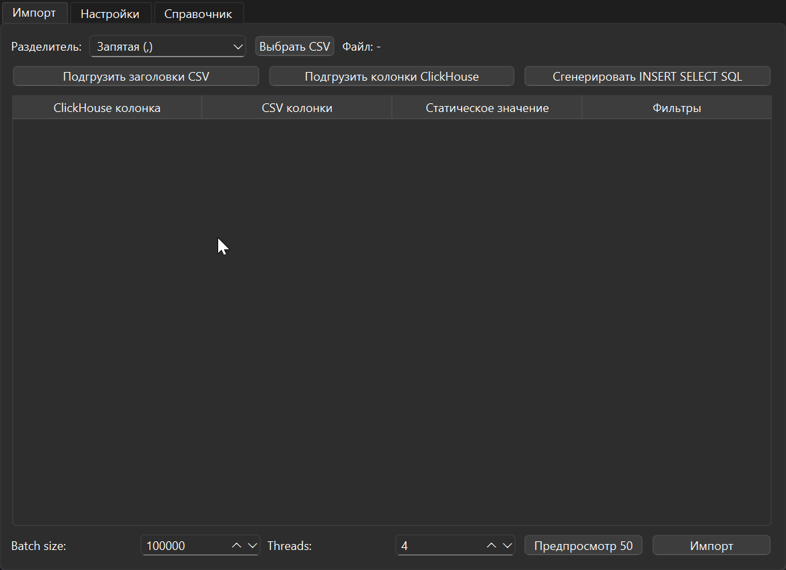

# DataBridge

**DataBridge** - это графический интерфейс для загрузки данных из CSV-файлов в ClickHouse с поддержкой сложных преобразований и фильтрации данных.

## Основные возможности
- **Множественный выбор колонок**: За счет QT доступна кроссплатформенность. 
- **Множественный выбор колонок**: Выберите несколько CSV-колонок для маппинга в одну колонку ClickHouse
- **Фильтрация данных**: Применение различных преобразований к данным (удаление символов, регулярные выражения, нормализация телефонов, форматирование дат)
- **Предпросмотр**: Визуализация первых 50 строк данных перед загрузкой
- **Параллельная загрузка**: Использование нескольких потоков для ускорения загрузки
- **Генерация SQL**: Создание SQL-запросов для staging-таблицы
- **Динамические значения**: Подстановка текущей даты/времени в статические значения
- **Форматирование**: Возможность форматирования строки которая будет записано в БД.
- **Зум таблицы**: Зум таблицы.

## Требования

- Python 3.7+
- PySide6
- clickhouse-driver

## Установка

1. Клонируйте репозиторий:
```bash
git clone https://github.com/rustnomicon/data-bridge.git
cd data-bridge
```

2. Создайте виртуальное окружение:
```bash
python -m venv .venv
source .venv/bin/activate  # Linux/MacOS
# или
.venv\Scripts\activate    # Windows
```

3. Установите зависимости:
```bash
pip install -r requirements.txt
```

## Сборка 
```bash
pyinstaller DataBridge.spec
```
## Использование

1. Запустите приложение:
```bash
python main.py
```

2. Настройте подключение к ClickHouse в разделе "Настройки":
   - HOST, PORT, USER, PASSWORD, DATABASE, TABLE

3. Выберите CSV-файл в разделе "Импорт"

4. Настройте маппинг колонок:
   - Выберите CSV-колонки для каждой колонки ClickHouse
   - Установите статические значения (например, {{CURRENT_DATETIME}})
   - Настройте фильтры для каждой CSV-колонки

5. Нажмите "Подгрузить колонки ClickHouse" для загрузки структуры целевой таблицы

6. Используйте "Предпросмотр" для проверки данных

7. Нажмите "Импорт" для загрузки данных

## Конфигурация

Настройки подключения сохраняются в `settings.json`:
```json
{
  "host": "localhost",
  "port": "9000",
  "user": "default",
  "password": "",
  "database": "default",
  "table": ""
}
```

## Логирование

Приложение ведет логи в файл `databridge.log` и в консоль.

## Динамические значения

Для подстановки текущей даты/времени используйте:
```
{{CURRENT_DATETIME}}
```

## Лицензия

Этот проект лицензирован под лицензией GNU - подробнее смотрите файл [LICENSE](LICENSE).